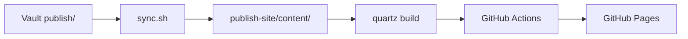

# Hello, Quartz!

このサイトの最初の記事。Quartz v4 が正しくセットアップされていることの確認用に書いた。

## 確認ポイント

このページが想定どおり表示されていれば、以下が動作している:

| 機能 | 状態 |
|---|---|
| Markdown レンダリング | 表が見えていれば OK |
| 見出し階層 | H1〜H3 が階層化されて目次になっていれば OK |
| シンタックスハイライト | 下のコードブロックに色がついていれば OK |
| Mermaid 図 | 下の図がレンダリングされていれば OK |
| サイドバーのフォルダツリー | 左に publish/ の構造が見えていれば OK |
| バックリンク | 右下に「リンクされたページ」が見えていれば OK |
| 検索 | 左上の検索ボックスからこのページが引けたら OK |

## サンプル: コードブロック

```typescript
// Quartz の設定例
const config: QuartzConfig = {
  configuration: {
    pageTitle: "Notes",
    locale: "ja-JP",
  },
}
```

## サンプル: Mermaid 図



## サンプル: リスト

- 順序なしリスト
- 2行目
  - ネスト
  - もうひとつネスト

1. 順序つきリスト
2. 2番目
3. 3番目

## サンプル: 引用

> このサイトは Obsidian Vault の `publish/` フォルダに置いたノートだけを Quartz で静的サイトに変換して公開している。
>
> ローカル編集 → push → 自動デプロイ、というフロー。

## 内部リンク

- [[index|トップに戻る]]

## 終わりに

このページが期待どおりに見えていれば、setup は成功です。あとは `publish/` に好きなノートを追加するだけ。
